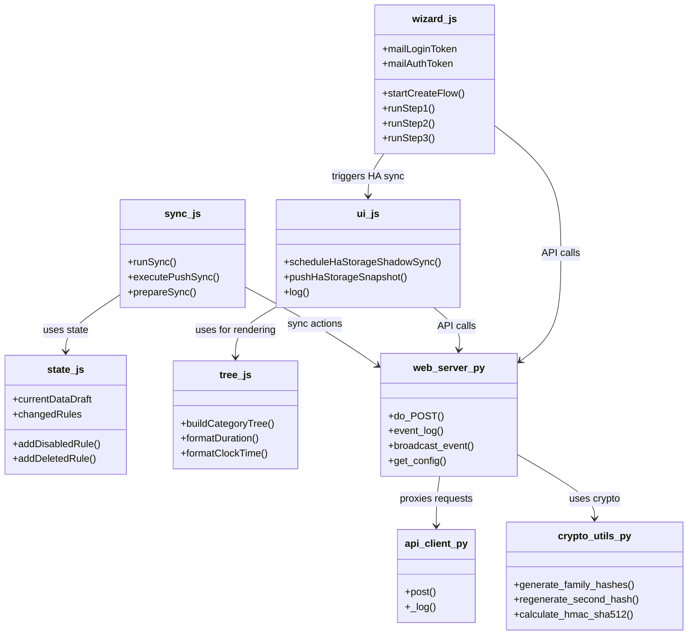
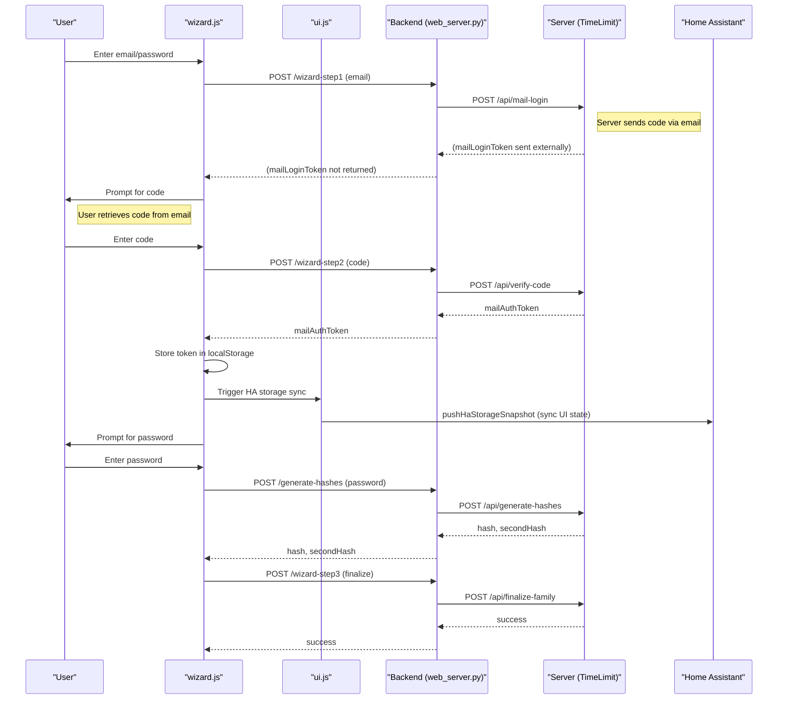
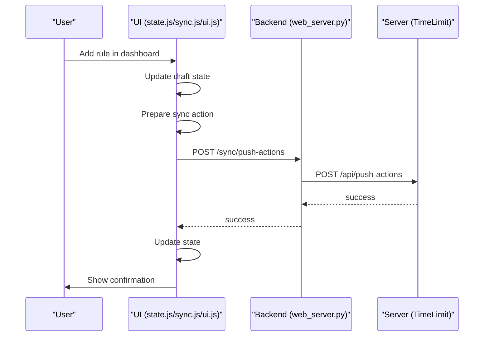
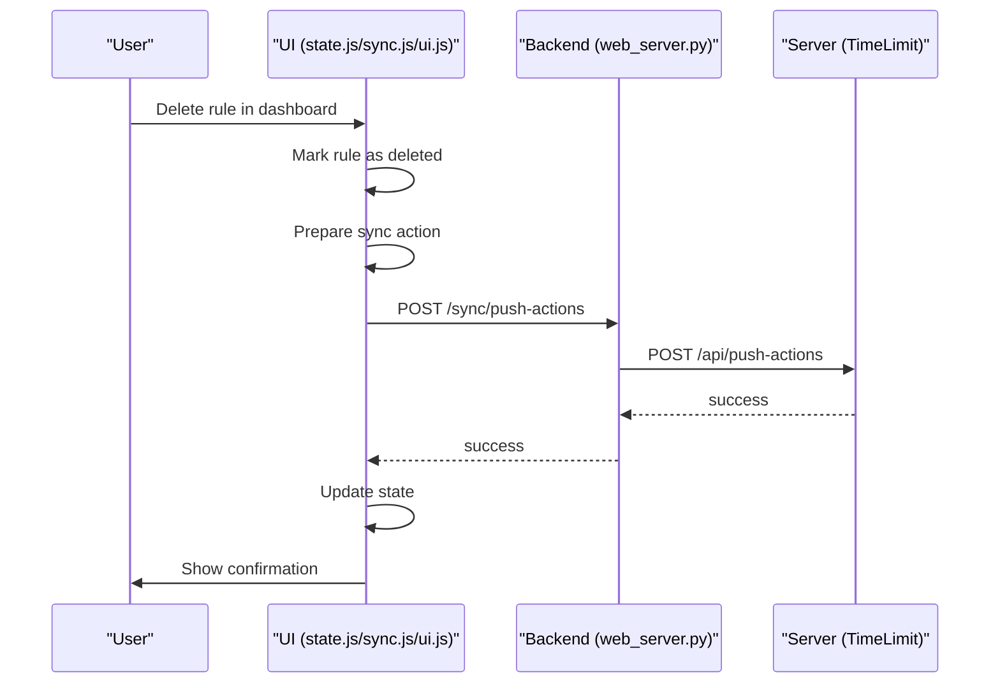
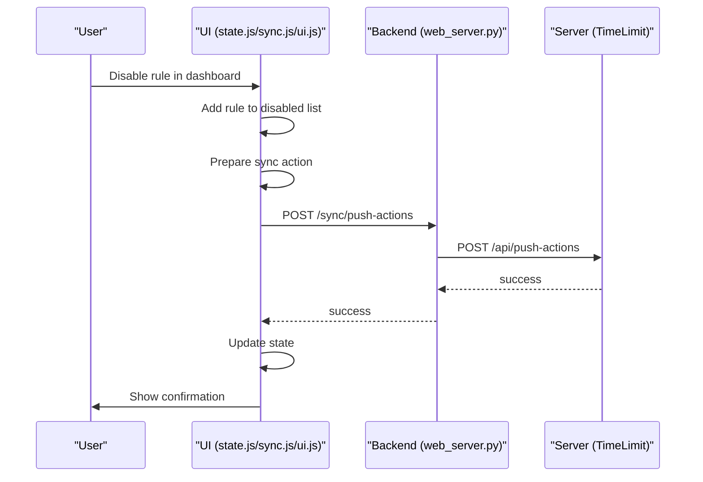

#### Componenten overzicht


# TimeLimit UI & Server Design Document

## Overview
## Collaboration Between TimeLimit UI and Backend Server

The TimeLimit UI is designed as the user-facing dashboard for managing device usage rules, categories, and user accounts. Its primary purpose is to provide a clear, intuitive interface for parents and administrators to configure time limits, monitor device activity, and manage family accounts. The UI handles all user interactions, state management, and local storage, ensuring a responsive experience and real-time feedback.

The backend server, on the other hand, is responsible for enforcing the rules, synchronizing device states, and maintaining persistent data. It acts as the authoritative source for all device and user information, processing API requests from the UI and other clients. The server validates actions, applies integrity checks, and ensures that all changes are securely stored and propagated to connected devices.

Collaboration between the UI and the backend server is achieved through a well-defined API. The UI sends requests for authentication, rule changes, and data synchronization to the server, which responds with updated state, validation results, and event notifications. The UI relies on the server for critical operations such as login, rule enforcement, and device management, while the server depends on the UI for user input and configuration.

This separation of concerns allows for robust, scalable, and secure operation. The UI focuses on usability and workflow management, while the backend server ensures data integrity, security, and enforcement. Together, they form a complete solution for managing device time limits and family accounts, with clear boundaries and reliable communication.
# TimeLimit UI Design Document

## Overview
This document describes the architecture and design of the TimeLimit UI and Server project. It covers the main files, their responsibilities, how functions and classes interact, and includes sequence diagrams for key scenarios.


## Project Structure

```
  timelimit-ui/
    config.yaml
    rootfs/
      usr/bin/
        api_client.py
        check_server.py
        crypto_utils.py
        frontend.py
        state.js
        sync.js
        tree.js
        ui.js
        wizard.js
      ...
  ...
```


## Main Components & Responsibilities


### Backend (Python)

#### web_server.py
web_server.py is the main HTTP server for the TimeLimit UI. It acts as the bridge between the frontend dashboard and the backend TimeLimit server. The file is responsible for handling all incoming API requests from the UI, including user authentication, rule management, and event broadcasting. It loads configuration from config.yaml and manages persistent storage for UI state. The server implements long-polling for real-time event updates, ensuring that UI clients receive timely notifications about changes. It also handles session management, including token validation and server selection. web_server.py integrates with crypto_utils.py to perform integrity and security checks, such as password hashing and HMAC signing. It uses api_client.py to proxy requests to the backend server, abstracting away network details and error handling. The file is designed to be robust, with detailed logging for debugging and operational monitoring. Its modular structure allows for easy extension, supporting new API endpoints and workflows as needed. Overall, web_server.py is the central orchestrator for backend logic, ensuring secure, reliable, and maintainable communication between the UI and the server.

#### api_client.py
api_client.py provides the HTTP client functionality for the backend. It is used by web_server.py to send requests to the TimeLimit server, handling POST requests and response parsing. The file abstracts away the complexity of network communication, including SSL context management and error handling. It implements detailed logging, supporting both standard and verbose modes for operational visibility. api_client.py ensures that all requests are properly formatted and encoded, reducing the risk of protocol errors. It is responsible for retry logic and fallback mechanisms in case of network failures. The file is designed to be reusable, supporting multiple endpoints and payload types. It also provides hooks for debugging, allowing developers to trace request flows and diagnose issues. By centralizing HTTP logic, api_client.py simplifies backend code and improves maintainability. Its integration with web_server.py ensures seamless communication with the TimeLimit server, supporting all core workflows such as authentication, rule sync, and event updates.

#### crypto_utils.py
crypto_utils.py contains all cryptographic helpers used by the backend. It provides functions for password hashing, integrity signing, and HMAC calculations. The file is essential for ensuring security and data integrity in the TimeLimit UI, matching the logic used in the Android app and server. It implements bcrypt hashing for passwords, supporting both primary and secondary hashes for maximum safety. crypto_utils.py also provides functions for regenerating hashes using server-provided salts, ensuring compatibility across platforms. Its HMAC-SHA512 and SHA512 digest functions are used for signing sync actions, preventing tampering and replay attacks. The file is designed to be robust, with detailed error handling and validation. It abstracts away cryptographic complexity, allowing other backend files to use secure primitives without deep knowledge of algorithms. crypto_utils.py is tightly integrated with web_server.py, supporting all workflows that require security checks. Its modular design allows for easy extension, supporting new hash types or signing methods as needed.

#### check_server.py
check_server.py is a utility for health checking the backend server. It is used to verify connectivity and operational status, ensuring that the UI can reliably communicate with the TimeLimit server. The file implements simple request logic, checking for expected responses and error codes. It is designed to be lightweight, running periodic checks without impacting performance. check_server.py provides hooks for alerting and logging, supporting operational monitoring and troubleshooting. Its integration with web_server.py allows for automated recovery and fallback in case of server failures. The file is essential for maintaining high availability, reducing downtime and user impact. It can be extended to support more complex health checks, such as database connectivity or API schema validation. Overall, check_server.py is a critical component for operational reliability, ensuring that the UI remains responsive and robust.

### Frontend (JavaScript)

#### ui.js
ui.js is the main entry point for UI logic in the TimeLimit dashboard. It manages user interactions, logging, and HA storage synchronization. The file is responsible for rendering UI panels, handling toggles, and updating the log area with real-time feedback. It implements long-polling for event updates, ensuring that users receive timely notifications about changes. ui.js integrates with sync.js, state.js, and tree.js to manage data flows and state updates. It provides formatting helpers for tokens and timestamps, improving readability and user experience. The file is designed to be modular, supporting new UI features and workflows as needed. ui.js also manages error handling, displaying alerts and status messages for operational issues. Its integration with backend APIs ensures seamless communication, supporting authentication, rule management, and onboarding flows. The file is essential for maintaining a responsive and intuitive user interface, supporting all core workflows in the dashboard.

#### sync.js
sync.js manages all synchronization logic for the TimeLimit UI. It handles both manual and automatic sync flows, tracking changes and preparing actions for server communication. The file implements integrity signing, ensuring that all sync actions are securely signed and validated. sync.js interacts with state.js to gather pending changes, new rules, and deleted rules, packing them into server action batches. It provides detailed logging and diagnostic information, supporting debugging and operational monitoring. The file is responsible for handling push and pull syncs, updating local state based on server responses. sync.js is designed to be robust, with error handling and fallback mechanisms for network failures. Its integration with ui.js ensures that users receive real-time feedback and status updates. The file supports extensibility, allowing for new sync actions and rule types as needed. Overall, sync.js is the core engine for data synchronization, ensuring consistency and integrity across the UI and server.

#### state.js
state.js maintains the draft state for the TimeLimit UI. It tracks all rule changes, new rules, and deleted rules, providing an in-memory working set for the dashboard. The file implements logic for managing disabled and deleted rules, supporting workflows such as temporary rule disabling and permanent deletion. state.js interacts with localStorage to persist state across sessions, ensuring that changes are not lost. It provides functions for loading and saving rule lists, supporting operational reliability. The file is designed to be modular, supporting new rule types and workflows as needed. state.js integrates with sync.js to prepare actions for server communication, ensuring that all changes are properly tracked and synced. Its error handling and validation logic prevent data corruption and inconsistencies. The file is essential for maintaining a consistent and reliable dashboard state, supporting all core workflows in the UI.

#### tree.js
tree.js is responsible for rendering the hierarchical view of categories, rules, and applications. It provides formatting helpers for durations, clock times, and day masks, improving readability and user experience. The file implements logic for building category trees from flat API data, attaching apps and rules to their respective categories. tree.js supports sorting and filtering, allowing users to navigate complex data structures with ease. It is designed to be modular, supporting new category types and rendering features as needed. The file integrates with ui.js and state.js to update the UI based on user interactions and state changes. Its error handling and validation logic ensure that the tree view remains consistent and accurate. tree.js is essential for visualizing the structure of the TimeLimit dashboard, supporting workflows such as rule management and app assignment.

#### wizard.js
wizard.js manages the onboarding workflow for new families and users. It implements steps for email entry, code verification, and password hashing, guiding users through the setup process. The file interacts with backend APIs to request login codes, verify authentication, and generate password hashes. wizard.js provides real-time feedback and error handling, ensuring a smooth and intuitive onboarding experience. It integrates with ui.js for logging and status updates, supporting operational visibility. The file is designed to be extensible, allowing for new onboarding steps and workflows as needed. wizard.js manages session state, tracking progress and user inputs across steps. Its validation logic prevents errors and ensures data integrity during onboarding. The file is essential for supporting new user acquisition, reducing friction and improving adoption of the TimeLimit UI.


## File Interactions & Function/Class Coupling


### Example Coupling


## Sequence Diagrams

### 1. Aanmelden bij server (Login)



### 2. Regel toevoegen (Add Rule)



### 3. Regel verwijderen (Delete Rule)



### 4. Regel tijdelijk uitzetten (Disable Rule)




## Design Notes


## Extensibility


## Authors & Contributors


## Appendix
## External Resources
- [TimeLimit Server Codebase on Codeberg](https://codeberg.org/timelimit)
- [TimeLimit Android App on Google Play](https://play.google.com/store/apps/details?id=io.timelimit.android.google.store)
